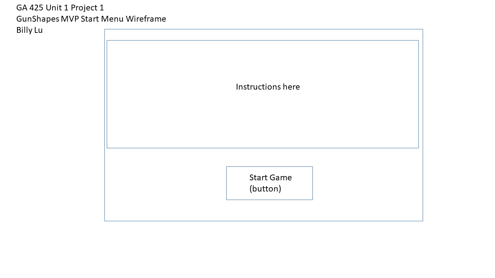
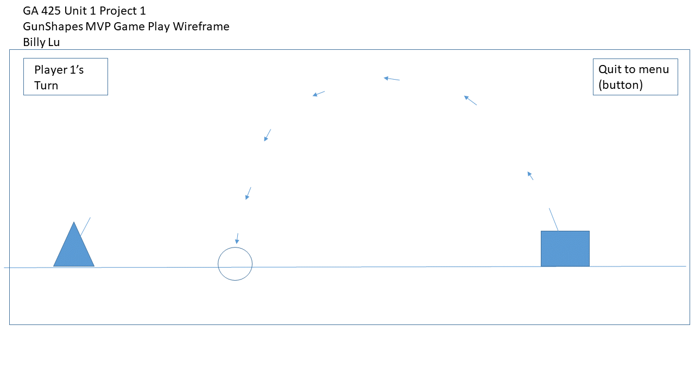
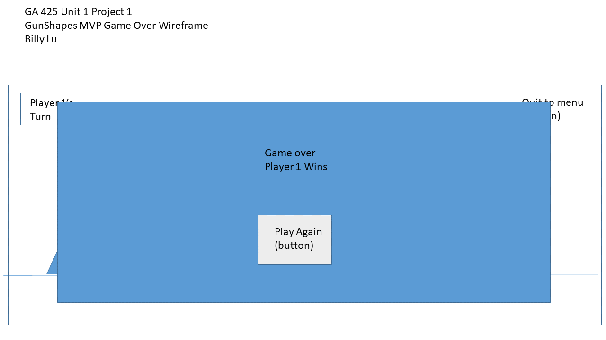

# GA-425-Unit1-P1
GA 425 Unit 1 Project 1 Repo

# GunShapes
-   Initial Description: Gunbound-clone with modifications (tbd)
-   Detailed Description: Two players will spawn in their own turrets and take turns firing at each other. First one to hit the other wins. Be forewarned, this game is not as simple as it appears.
---
[GunShapes game link](https://bluz225.github.io/GA-425-Unit1-P1/)
---
## Wireframes:

### Start Menu: Wire Frame 1

 

### Game Play: Wire Frame 2

 

### Game Over: Wire Frame 3

 

---
## Anticipated technologies to use:
- Canvas
- JS
- Html and CSS for menu and game setup
- Physics Equations for projectile motion

---
## (TECHNICAL?) REQUIREMENTS:
## MVP
#### Start Menu 
- [x] IFU
- [x]  pvp mode
#### Game Play 
- [x]  show current player
- [x]  generate and render player 1 and player 2 as chosen "turret" shapes/assets
- [x]  implement a barrel that is controlled by w s / up and down arrow
- [x]  fires on space bar click from barrel opening
- [x]  implement turn switching
- [x]  generate flat landscape
- [x]  generate a projectile when fired and show projectile motion
- [x]  wait until projectile visual has finished before switching to next player
- [x]  implement gravity and projectile motion
- [x]  constant initial velocity of projectile fired
- [x]  implement explosion (circular) radius visual and hitbox on impact
- [x]  calculate if the hitbox overlaps with enemy player
### Game Over
- [x]  end game once one player has been hit
- [x]  display winner and have option to return to start menu or play again
- [x]  implement exit to start menu button
---
## Stretch Goals

- [ ]implement win counters for each player
- [x]implement aim hud during player turn that remembers/shows last shot angle
- [ ]implement showing current aiming angle (0-180 degrees)
- [ ]implement different turrents that can be chosen at start menu
- [ ]implement HP so its not 1hit kill
- [ ]  implement increased damage for high angled shots
- [ ]implement different cannon "types" 
- [ ]  where projectile behavior isnt based solely on gravity/projectile motion
- [ ]  different bullet behavior
- [x]implement wind on random start time with random duration timer
- [x]  random wind speed
- [x]  random wind direction (left and right)
- [x]  random wind direction: variable-360 degrees (testing shows 360 degrees is not fun/feasible)
- [ ]pve mode
- [ ]  have computer randomly shoot
- [ ]  remember where it shot and if the shot landed too short then set a hard min limit on next shot angle. If too high then set hard max limit. Self iterating until it wins.
- [ ]variable intial velocity of projectile fired based on how long the left-mouse has been held down
- [ ]  implement a hud to show 0->max 
- [x]  implement a cannon aim with a 180 degree hud centered around the "turret" asset
- [ ]  implement trail for projectile
- [ ]implement movement of turret
- [ ]implement landscape with a hill in the middle
- [ ]implement landscape with RANDOMLY GENERATED hill(s)
- [ ]implement land destruction

